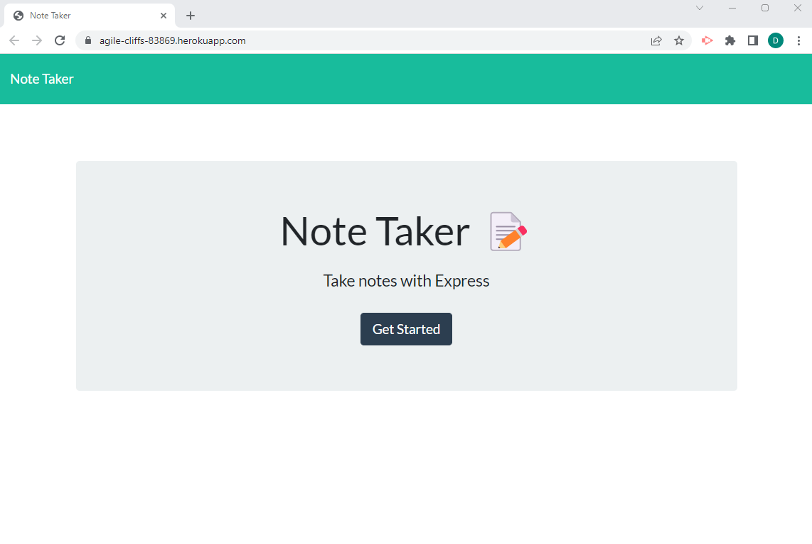
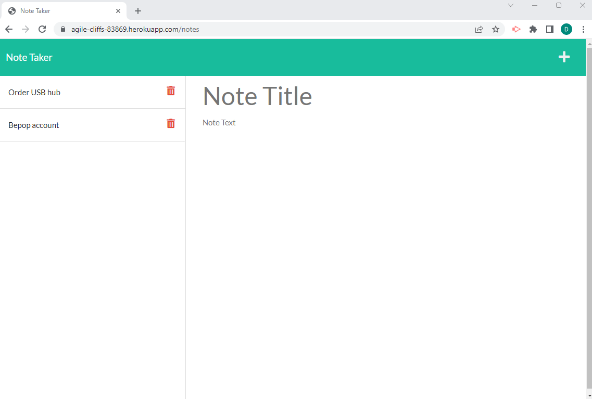

# Note Taker [](https://opensource.org/licenses/MIT)  
  
  ## Table of Contents  
  * [Description](#description)
  * [Installation](#installation)
  * [Usage](#usage)
  * [Tests](#tests)
  * [Technologies Used](#technologies-used)
  * [Credits](#credits)
  * [Questions](#questions)
  * [How to Contribute](#How-to-Contribute)   
  * [License](#license)
  
  ## Description

  The motivation behind this project is to create an application that can be used to write and save notes.

  The Note Taker application developed in this project uses Express JS back-end and  a JSON file to provide data persistence.  The main development aim of this project was to build the back-end, link to the [front-end](#credits), connect the two and deploy the application to Heruko. 
  
    
  ### Functional Requirements

  The functional requirements that the Note Taker application has been designed to meet are defined by the user story and acceptance criteria listed below.  

  #### User Story

  ```md
AS A small business owner
I WANT to be able to write and save notes
SO THAT I can organize my thoughts and keep track of tasks I need to complete
```

 

#### Acceptance Criteria

```md
GIVEN a note-taking application
WHEN I open the Note Taker
THEN I am presented with a landing page with a link to a notes page
WHEN I click on the link to the notes page
THEN I am presented with a page with existing notes listed in the left-hand column, plus empty fields to enter a new note title and the note’s text in the right-hand column
WHEN I enter a new note title and the note’s text
THEN a Save icon appears in the navigation at the top of the page
WHEN I click on the Save icon
THEN the new note I have entered is saved and appears in the left-hand column with the other existing notes
WHEN I click on an existing note in the list in the left-hand column
THEN that note appears in the right-hand column
WHEN I click on the Write icon in the navigation at the top of the page
THEN I am presented with empty fields to enter a new note title and the note’s text in the right-hand column
```


  ## Installation
  
    No installation is required.  See  the usage section.

  ## Usage

  On Opening the <a href="https://agile-cliffs-83869.herokuapp.com/" target="_blank"> Note Taker Website</a> you will be presented with a landing page. To use the app, follow the instructions below:

  - click on the 'Get Started' button to navigate to the notes page.
  - When the page opens the title of any previously saved notes will appear on the left-hand coloumn.
  - To enter a note, :
    - Click on the 'Note Title' in the right-hand column and enter the title of your note.
    - Click on the 'Note Text' in the right-hand column and enter the text you wish to add.
  - After you have entered text into both the Note 'Title' and 'Text' fields, a Save icon will appear in the top right-hand corner of the page.  CLick this icon to save your note.
  -  Your note will be added to the left-hand column - the note title will be displayed only.
  - In order to view saved notes click on the note title in the left-hand column - this willl display the note text and title in the right-hand column.
  - To clear the note from the right-hand column, click on the 'plus' icon in the top right-hand corner.
  - To delete a note click on the 'bin' icon next to the note title in the left-hand column. 

  ## Screen Shots

  The following screen shot shows the Note Taker application landing page.

  


  The following screen below displays the note taker page where a user can add and view sa ved notes.

  
  

  
  ## Deployed Application

  - <a href="https://agile-cliffs-83869.herokuapp.com/" target="_blank"> Link to the Note Taker website</a>

  - <a href="https://github.com/Beanalini/cosmicDragonfly"> Link to the Note Taker repository</a>


  ## Tests
  No tests have been implemented.

  ## Technologies Used
  -  HTML
  -  CSS
  - JavaScript
  - Node Js
  - Express Js
  - uniqid (Unique number generator, npm package)
  - Heruko
  
  

  ## Credits

  The front-end code used in this project was provided  by Trilogy 2U as part of a project completed for the full-stack web development Bootcamp course, and can be cloned from the following Repository:

  - Note Taker starter Code
 
  ## Questions
  If you have any questions regarding this project or contents of this repository, please contact me via:
  
  - email: dat826@gmail.com
  - GitHub: [Beanalini](https://github.com/Beanalini)  


  
  ## Contributing
  If you would like to contribute to this project you can contact me by email at dat826@gmail.com or through  GitHub account   @[Beanalini](https://github.com/Beanalini).
  

  ## License
  This project is covered under the MIT License  
  
  [](https://opensource.org/licenses/MIT) 
  